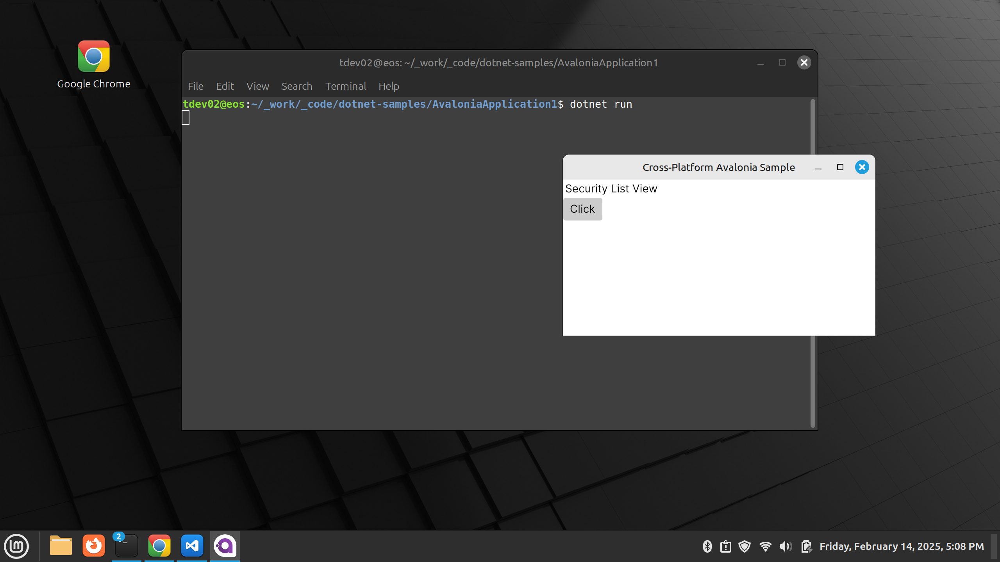

# AvaloniaAppExample

## `Monday, 2/17/25`

- Continuing on with this sample, renaming it for `AvaloniaAppExample`

## `Sunday, 2/16/25`

- Found [npolyak](https://github.com/npolyak)
- Excellent code repository with demos and a docking control example (future commercial product)?
- [UniDock](https://github.com/npolyak/NP.Ava.UniDock/tree/main)
- Also, working on [ReactiveUI](https://www.reactiveui.net/) Samples
- Also, look at [Roland's Cool Examples](https://github.com/RolandPheasant)

## `Friday, 2/14/25`

- A cross-platform example using Avalonia
- Note, very early days yet
- Things definitely look different in different environment
- Example of running on my linuxmint development laptop:

- Example of running on my Windows 11 desktop computer:

