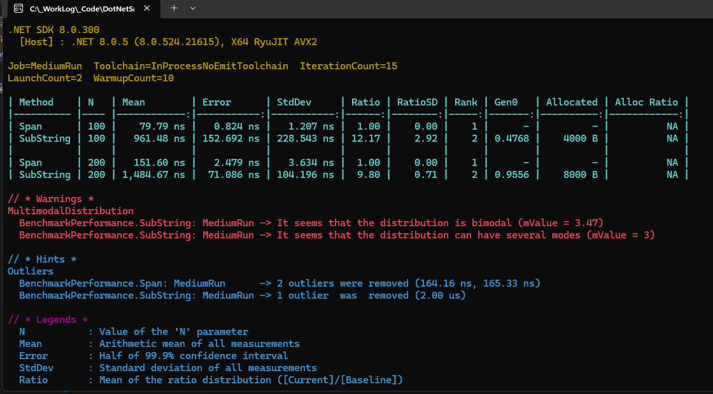
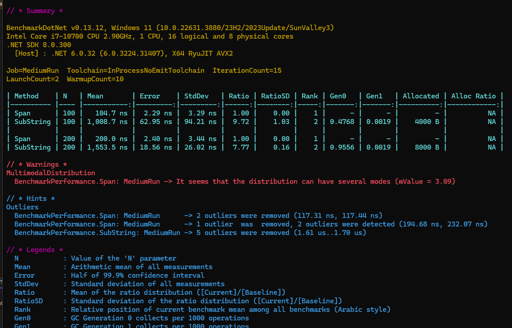
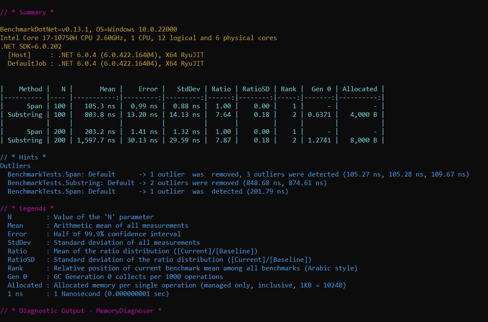
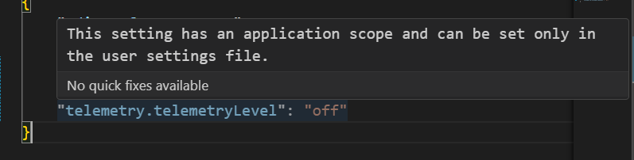
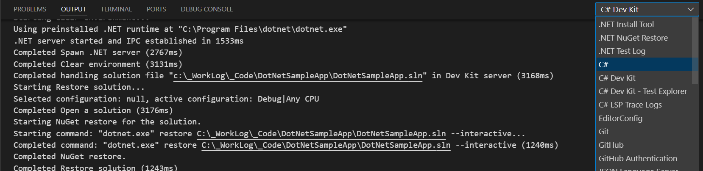
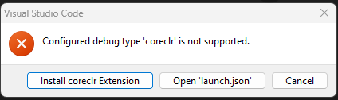
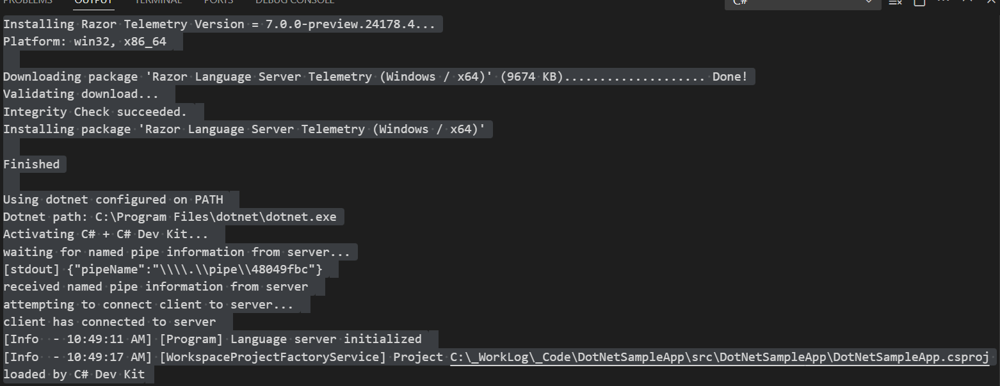
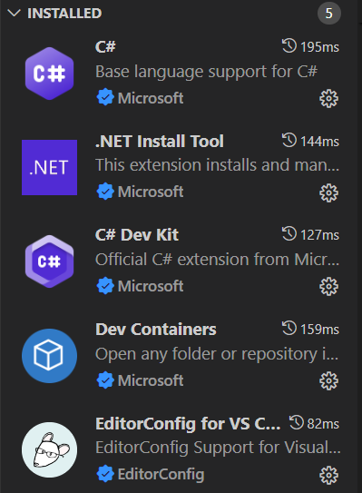

# DotNetSampleApp

## Wednesday, 7/10/24

- Working through some examples using `BenchmarkDotNet` and `ReadOnlySpan`
- These results look interesting, note `net6.0` vs. `net8.0` result(s):





- Note the difference with the results from the [article](https://www.codemag.com/Article/2207031/Writing-High-Performance-Code-Using-SpanT-and-MemoryT-in-C)



- My machine is a little more powerful (in terms of cores) than his and I am seeing a 10-12x improvement
- Also, I am using `.NET 8` which might have an affect
- Yup, looks like I'm pretty much getting the same results as him, see my `net6.0` run above.
- I also appear to have [AVX2](https://en.wikipedia.org/wiki/Advanced_Vector_Extensions) support, which he doesn't have
- My `net6.0` appears a little out-of-date, compared to his
- I wonder how this will work on my new laptop

## Sunday, 7/7/24

- https://github.com/dotnet/vscode-csharp/issues/5402
- It looks like the _language server_ is installed with the \
`C# Dev Kit` extension

## Saturday, 7/6/24

- Looking at `Razor Telemetry` and trying to turn it off \
(until I understand what it is and does)
- See [here](https://code.visualstudio.com/docs/getstarted/telemetry#_disable-telemetry-reporting)



- Reviewing the information in this [link](https://code.visualstudio.com/docs/getstarted/telemetry#_output-channel-for-telemetry-events) and this:



- Really nice!

- Cloned repo to my desktop machine: `DESKTOP-5PV6HMC`
- Hit `Control-F5` and encountered:



- Noticed that I was in my default profile
- Went to my `C#` profile and clicked on `Reinstall Extensions` and got the following text in my terminal.
- (See `docs\2024-07-06-01-terminal.txt`)
- And I was able to run the app





## Thursday, 7/4/24

- Create directory & change to it
- Run `git init`
- Manually created `.vscode` directory and `settings.json`
- Added entry for:

```json
{
    "window.zoomlevel": 2
}
```

- And immediately noted that it took effect
- Updated `settings.json` as follows:

```json
{
    "editor.formatOnSave": true,
    "window.zoomLevel": 2,
    "terminal.integrated.defaultProfile.windows": "Git Bash"
}
```

- New terminal: `Control+Shift+{BACKTICK}`
- From project root directory:

```text
dotnet new console -o src/DotNetSampleApp
```

- And run with:

```text
dotnet run --project src/DotNetSampleApp
```
