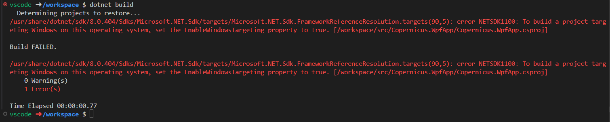
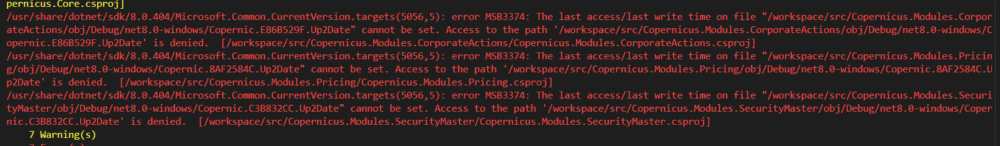
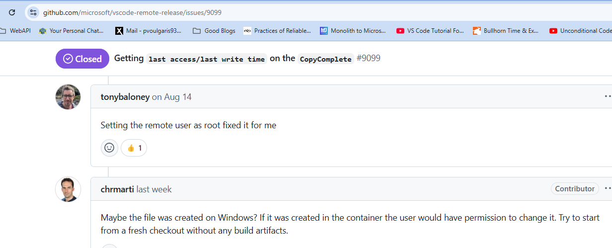

# Modular Windows App Example

## `Sunday, 2/16/25`

- Added comment in other project to make sure build is _not_ triggered

## `Wednesday, 2/12/25`

- Look at items from `Wednesday, 8/7/24`

### What To Do Next?

- Properly handle main view `Activate` and `Deactivate`
- Styles for the `DataGrid` columns
- Implement code to dynamically add/style columns at runtime from some store (get this code out of the xaml)
- Factory or builder method for creating these, with binding to relevant view models
- Look into `Visual State` transitions for nicer look-and-feel
- Implement actual `Domain` model objects, with behavior and rules
- Implement in-process notification, `Mediator`
- Look at different implementations of `IViewManager` and move that code out of the `Copernicus.WpfApp.MainWindow` code-behind
- Continue to refine the framework, Interfaces for common workflows
- Create `ToolBar`, `Menu` and/or `RibbonBar` impementations and their backing view models/behaviors
- Create `StatusBar`, `Toasts`, etc.
- Add logging, tracing
- Add some connectivity to actual data from public/free API's
- Implement logic to consume `Observables`, [maybe](https://introtorx.com/)

## `Wednesday, 12/18/24`

- Added `devcontainer` support, some clean-up of the `vscode` settings, etc.
- Encountered this error on my Windows machine:

- Then got this:

- Maybe, I can't do this in a devcontainer?
- The comment [here](https://github.com/microsoft/vscode-remote-release/issues/9099) about setting `remoteUser=root` worked for me:

- Haven't tried to run it yet though.

## `Wednesday, 8/7/24`

- Created shell application
  - Very early days here, this is just good for `POC` or _Demo_ purposes
  - This all took me about 2-3 hours to this point
- Created three (3) shell modules, that are dynamically loaded
- Code loads the module assemblies
- Gets a reference to the `IModule` interface and calls the `Initialize` method \
  passing in a reference to the `IViewManager` interface
- The `IViewManager` implementation allows the module to hook-into the Core implementation \
  provided by the main application window (as one example)
- Possible next steps could be:
  - Generalize the module management, loading/unloading, dynamic discovery, etc.
  - Add logging, instrumentation, support for DI
  - Generalize the `IViewManager` implementation and exactly how a module hooks into \
    and communicates with the _main_ application
  - Add unit tests, automated builds, etc.
  - Look into how this might work with `.NET MAUI` and any other intesting `.NET` windows technology
  - This should be generalizable for other _kinds_ of modules, exposing other _kinds_ of functionality
  - Services, databases, queues, caching
  - Any interesting `Azure` interactions and/or use-cases
